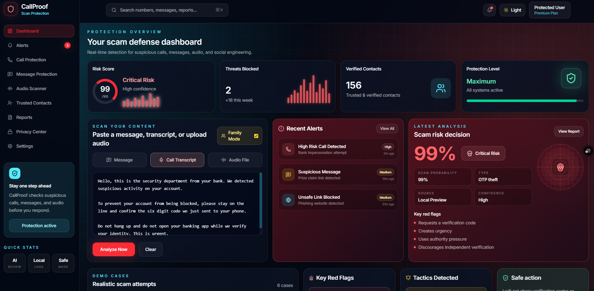
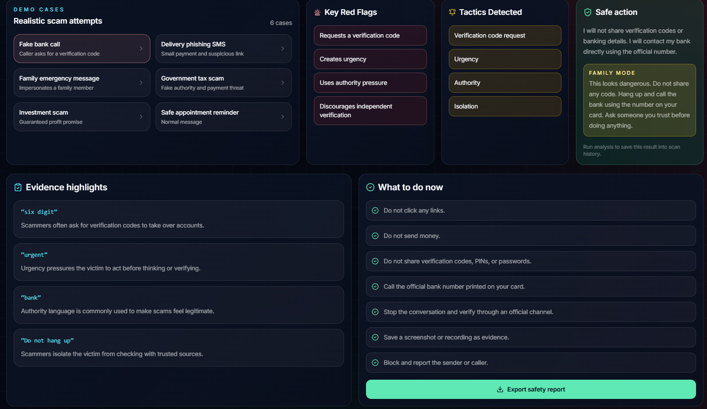
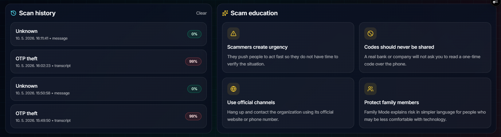

# CallProof

**CallProof** is a scam call and message detection dashboard that helps users check suspicious conversations before they respond.

It analyzes messages, call transcripts, and uploaded audio to estimate scam risk, detect manipulation tactics, highlight suspicious evidence, and recommend safe next steps.

## Hackathon Submission Materials

- [Supporting Documentation PDF](./CallProof_supporting_documentation(1)(1).pdf)

**Live demo:** https://call-proof.vercel.app/

---

## Elevator Pitch

**Know if a call or message is safe before you respond.**

CallProof helps people detect scam calls, fake messages, phishing attempts, OTP theft, and social engineering patterns by combining AI semantic analysis with a rule-based scam detection engine.

---

## Screenshots

### Critical Risk Dashboard



### Evidence, Next Steps and Risk Breakdown




### Scan History and Scam Education



---

## Problem

Scam calls and fake messages are becoming more realistic and harder to recognize.

Attackers often pressure people with urgency, fear, authority, fake security warnings, family emergencies, payment requests, or verification code requests. Many victims only realize something was a scam after they already clicked a link, sent money, or shared sensitive information.

CallProof is designed to slow that moment down and help the user verify the situation first.

---

## What It Does

CallProof lets a user:

- paste a suspicious message
- paste a call transcript
- upload an audio recording
- transcribe audio before analysis
- run scam risk analysis
- see a scam probability score
- identify the likely scam type
- review red flags and manipulation tactics
- see evidence highlights
- get safe next steps
- export a safety report
- save recent scans locally

The interface changes based on risk:

- **0–29%**: green safe state
- **30–79%**: yellow review state
- **80–100%**: red critical risk state

---

## Key Features

### AI Semantic Review

CallProof can use an AI model to understand the meaning and intent behind a suspicious message or transcript, instead of relying only on exact keyword matches.

### Rule-Based Scam Engine

The app also includes a deterministic fallback engine that checks for common scam signals such as:

- OTP or verification code requests
- bank impersonation
- urgent payment pressure
- fake delivery links
- suspicious URLs
- authority pressure
- secrecy or isolation tactics
- family emergency manipulation
- investment or guaranteed profit claims

### Audio Upload and Transcription

Users can upload a call recording. CallProof transcribes the audio and then analyzes the transcript for scam patterns.

### Adaptive Risk Radar

The analysis panel includes a visual radar state:

- green shield for safe content
- yellow warning for suspicious content
- red skull for critical risk

### Evidence Highlights

CallProof highlights suspicious phrases from the message or transcript and explains why they matter.

### Safe Action Guidance

The app recommends what the user should do next, such as:

- do not click links
- do not send money
- do not share verification codes
- call the official organization directly
- save evidence
- block and report the sender or caller

### Family Mode

Family Mode explains the result in simpler language for users who may be less comfortable with technology.

### Exportable Safety Report

Users can export the scan result as a text report for review, evidence, or future reference.

### Local Scan History

Recent scans are stored locally in the browser so the user can review previous results.

---

## Demo Scenarios

CallProof includes realistic demo cases:

1. Fake bank call
2. Delivery phishing SMS
3. Family emergency message
4. Government tax scam
5. Investment scam
6. Safe appointment reminder

---

## How It Works

```txt
Message / Transcript / Audio Upload
        ↓
Audio Transcription
        ↓
AI Semantic Review
        ↓
Rule-Based Scam Signal Detection
        ↓
Risk Score + Attack Type
        ↓
Evidence Highlights
        ↓
Safe Action + Next Steps
        ↓
Export Report + Local History
```

---

## Tech Stack

- Next.js
- React
- TypeScript
- Tailwind CSS
- Lucide React
- OpenAI API
- Vercel

---

## Project Structure

```txt
callproof/
  app/
    api/
      analyze/
        route.ts
      transcribe/
        route.ts
    globals.css
    page.tsx

  components/
    AnalyzerPanel.tsx
    Card.tsx
    DashboardPanels.tsx
    LatestAnalysisPanel.tsx
    Sidebar.tsx
    TopBar.tsx
    types.ts

  lib/
    aiAnalyzer.ts
    demoCases.ts
    scamEngine.ts
    types.ts

  public/
    screenshots/
      01-dashboard-critical-dark.png
      02-risk-breakdown-dark.png
      03-evidence-next-steps-dark.png
      04-history-education-dark.png
```

---

## Environment Variables

Create a `.env.local` file:

```env
OPENAI_API_KEY=your_openai_api_key
OPENAI_MODEL=gpt-4o-mini
OPENAI_TRANSCRIBE_MODEL=gpt-4o-mini-transcribe
```

For Vercel deployment, add the same variables in:

```txt
Project Settings → Environment Variables
```

---

## Getting Started

Install dependencies:

```bash
npm install
```

Run locally:

```bash
npm run dev
```

Build:

```bash
npm run build
```

---

## Deployment

The project is deployed on Vercel:

https://call-proof.vercel.app/

To deploy your own version:

```bash
npm run build
git add .
git commit -m "Deploy CallProof"
git push
```

Then import the repository into Vercel and add the required environment variables.

---

## Why CallProof Matters

Scams often work because people are pressured to act quickly.

CallProof gives users a moment to pause, check the message or call, understand the risk, and choose a safer action before sharing money, codes, passwords, or personal information.

---

## Future Improvements

Planned improvements include:

- live call monitoring
- phone number reputation checks
- multilingual scam detection
- browser extension for suspicious links
- persistent database logs
- user accounts
- trusted contact verification
- official scam reporting integrations

---

## Built By

Built as a hackathon MVP focused on practical scam prevention, explainable risk scoring, and safer user decision-making.
